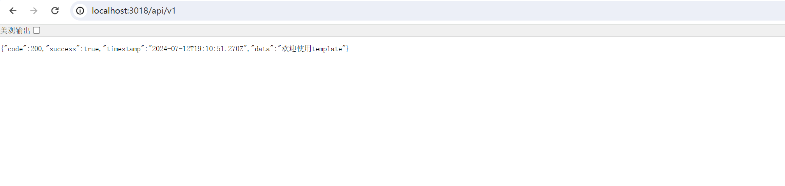
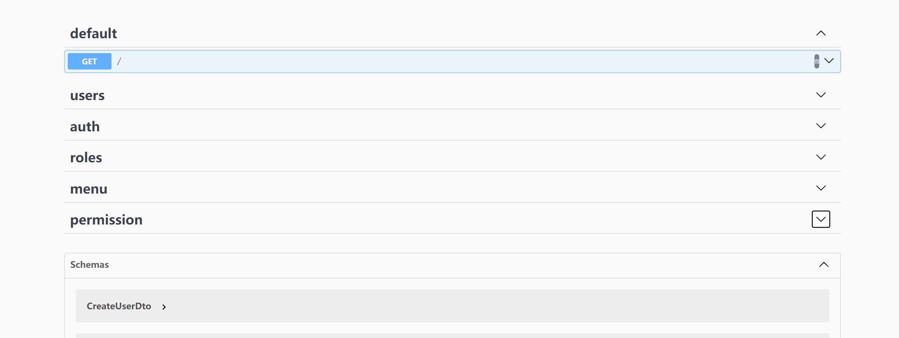

# vue-nest-monorepo-template

## 目录

- [介绍](#介绍)
- [特点](#特点)
- [技术栈](#技术栈)
- [已实现模块](#已实现模块)
- [安装](#安装)
- [待办事项](#待办事项)

## 介绍

最简单的开箱即用的nodejs前后端开发模板/脚手架，可快速开发应用，对前端同学友好。

v3-admin-vite：https://github.com/un-pany/v3-admin-vite

后端：nest restful api 提供了完整的单体应用请求-响应链路，包括日志记录、身份验证、RBAC 控制、API 限流、请求数据序列化和响应数据序列化。

前端：通过pnpm workspace与后端nest应用实现了方法及类型共享，可快速切换各种应用

项目旨在为有兴趣转向后端或全栈开发的前端同学提供参考和使用。

# 内置基于 v3-admin-vite的前端模板，开箱即用。使用admin模板切换dev-amin分支。

## 特点

- 提供docker-compose及dockerfile便捷的本地调式及部署
- 基于 RBAC 的权限管理系统，提供细粒度的 API 访问控制，防止越权访问。
- 采用 Monorepo + TypeScript 架构，前端和后端可共享类型定义和方法。shared 包会同时打包为 CommonJS 和 ESM 格式，方便前后端调用。
- 使用 Prisma 快速构建数据库模型，并解决了 Prisma 无法使用 @Comment 描述字段入库的问题。
- 提供 Swagger UI 文档，方便 API 调试和文档管理。

## 技术栈

| 层级           | 技术                   |
| -------------- | ---------------------- |
| 前端           | Vue 3 + Vite           |
| 后端           | NestJS                 |
| 数据库和 ORM   | Prisma + MySQL + Redis |
| 数据验证       | Class Validator        |
| 身份验证和授权 | JWT + Casl             |
| 数据加密       | Argon2                 |

## 已实现模块

| 模块     | 进度 |
| -------- | ---- |
| 注册登录 | 100% |
| 菜单管理 | 100% |
| 角色管理 | 100% |
| 权限管理 | 100% |
| 日志模块 | 100% |
| 字典管理 | 0%   |

### 快速安装

1、克隆项目到本地

```
git clone  https://gitee.com/quct/vue-nest-monorepo.git
```

2、全局安装pnpm

```
npm install -g pnpm
```

3、下载docker desktop或者下载mysql、redis到本地<br/>

（此处强烈建议安装docker desktop，配合项目中的docker-compose一键运行mysql、redis）<br/>

docker 安装使用可参考：https://docker.easydoc.net/<br/>

docker desktop安装：https://www.docker.com/products/docker-desktop/<br/>

4、安装docker desktop后进入back-end目录使用命令启动docker

（如果直接使用本地的mysql、redis，请参考back-end目录下的.env文件及config目录下的文件配置数据库）<br/>

```
cd ./packages/back-end

docker-compose up -d
```

此命令会根据back-end目录下的docker-compose.yml文件下载启动mysql、redis

5、下载依赖

```
pnpm install
```

后续如果想下载全局依赖可执行

```
 pnpm install xxx -w
```

如果想给某个包单独安装，比如给back-end安装可使用

```
pnpm --filter ./packages/back-end i xxxx
```

6、初始化数据库环境，进入back-end目录执行

```
    npm run db:init
```

7、启动项目，在根目录执行命令可启动前后端项目

```
pnpm run start:all
```

如果想单独启动后端项目，执行

```
pnpm --filter ./packages/back-end run start:dev
```

单独启动前端项目

```
pnpm --filter ./packages/front-end run dev
```

后端运行后
访问http://localhost:3018/swagger 即可查看接口文档<br/>
访问http://localhost:3018/api/v1/ 即可使用接口服务<br/>
前端访问http://localhost:5173/



### 待办事项

[] 提供字典模块

[√] 提供缓存模块

[ ] 提供admin前端集成
